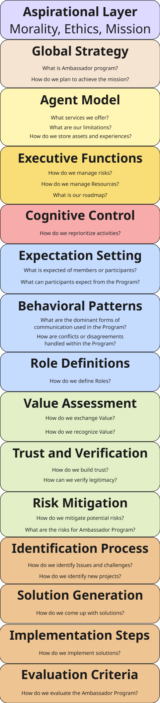

# Getting Started

## Welcome to the **Knowledge Base GitBook**

This page is an entry point into understanding and contributing to the Knowledge Base.

This GitBook organises core insights, processes, and systems that define how the Ambassador Program functions. The documentation can get outdated as the space evolves. Knowledge Base WG members help to champion the change in the Knowledge Base GitBook.  
More about [Knowledge Base Workgroup here](https://docs.google.com/document/d/1lQfYm1Wf-RD7pZgKAk7dPwrdTS8qCagSAOzRWoGYHEM)

## Knowledge Base Structure

The content is structured into **key categories** that reflect an area of the Ambassador Program. Each category is paired with guiding questions, definitions, and a relation to the Ambassador Program.

These categories were selected to **capture a holistic view** of how the Ambassador Program operates in a decentralised and adaptive environment. We have used the Autonomous Cognitive Entity Framework as our base model, with some additional system design schemas.
Some assets and tools are separated from the framework and listed under the Tools and Channels section to reduce the overload of assets under framework categories.

Structure and Descriptions can be improved with suggestions and comments on the [Category Descriptions Google Doc](https://docs.google.com/document/d/1NzpysgIDsZFigFJz4Tiik3h2l0X4FJTJC4xEbGiwsUw)

<figure><figcaption>
Knowledge Base Structure
</figcaption></figure>

## Intro Video

Here is a quick (2min) overview of how to use the Knowledge Base



## Additional Context

You can find more information (7min) on the organisation process and strategy in this video



A bit of historical context of Knowledge Base from Opening Session Summary video (5min)



